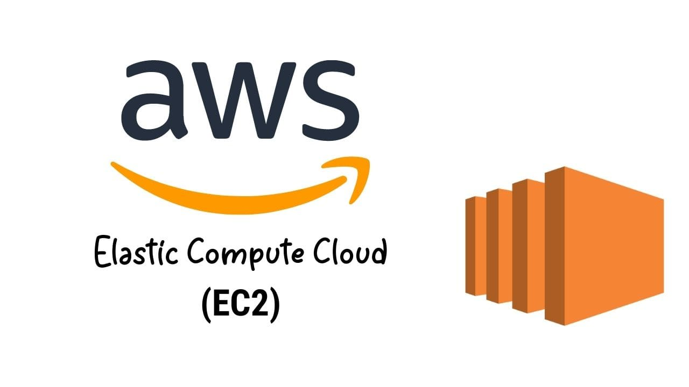

#  AWS IAM – Advanced (Scenario-Based Hands-On) 

This repo contains **EC2 basics** concepts used in real production environments.  
Each scenario focuses on *practical, hands-on implementations* involving ec2 day to day practise.

---

## 📁 **Scenarios Covered**

---

## **Scenario 1 — Deploy an EC2 Instance & Launch a Hello-World Website (Without Login)**

Requirement:
Deploy an EC2 instance and automatically host a "Hello World" webpage without SSH/RDP access.
Solution uses **EC2 User Data** to install Apache and push content during boot.

---

## **Scenario 2 — EC2 Website Not Loading With Same Public IP (Elastic IP Not Attached)**

Yesterday website was accessible using a public IP →
Today it stopped working after stop/start of instance.
Reason: AWS assigns a *new* public IP on every reboot.
Solution: use **Elastic IP** for persistent public access.

---

## **Scenario 3 — Can an Elastic IP Be Moved to a Different Instance?**

Explain:
✔ Yes, Elastic IP can be detached and reattached
✔ Used during failover or disaster recovery
✔ No downtime except a few seconds during reassignment

---

## **Scenario 4 — How to Release/Delete an Elastic IP**

Requirement:
Remove EIP when no longer needed to avoid AWS cost.
Steps: disassociate → release back to AWS pool.

---

## **Scenario 5 — EC2 Placement Groups (Cluster, Spread, Partition)**

Explain creation of:

* **Cluster Placement Group** → High-speed Network Performance
* **Spread Placement Group** → High Availability across racks
* **Partition Placement Group** → Large-scale distributed systems (Hadoop, Kafka)

---

## **Scenario 6 — Delete EC2 Placement Groups**

Requirement:
Understand limitations — placement group must be empty before deletion.

---

## **Scenario 7 — Securely Connecting to Windows EC2 (RDP vs Session Manager)**

Compare:

* RDP: traditional, requires port 3389 open
* Systems Manager Session Manager: no open ports, secure, IAM-controlled
  Real-world use: secure enterprise environments.

---

## **Scenario 8 — Assigning a Custom Private IP Before Launch (Static Private IP)**

Requirement:
Instead of AWS auto-assigning a private IP, assign your own based on subnet CIDR.
Useful for:

* Database servers
* Application servers with fixed backend IP
* Legacy systems

---

## **Scenario 9 — How to Increase CPU & RAM for an EC2 Instance**

Requirement:
Modify instance type (t2.micro → t3.large).
Must **stop the instance**, change type, then start again.

---