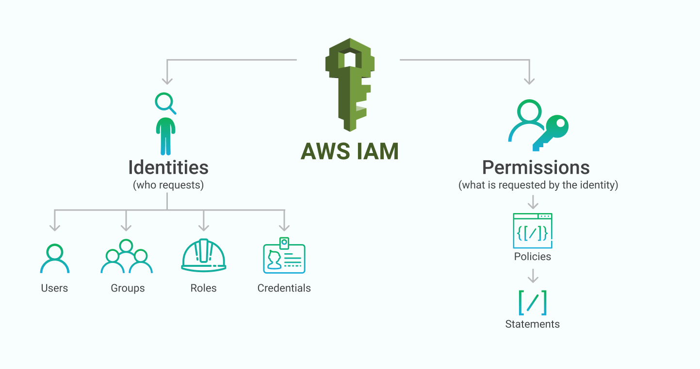

#  AWS IAM – Advanced (Scenario-Based Hands-On) 

This repo contains **advanced AWS Identity & Access Management** concepts used in real production environments.  
Each scenario focuses on *practical, hands-on implementations* involving AWS Organizations, SCPs, cross-account access, resource-based permissions, and identity federation.

---

## 📁 **Scenarios Covered**

### **Scenario 1️: Invite AWS Accounts Into AWS Organization**  
- Add a member AWS account to the master Organization.  
- Understand how multi-account management works.  

---

### **Scenario 2: AWS Organizations – Creating an OU and Applying SCP for EC2 Read-Only Access**  
- Create **Dev-Team OU**  
- Apply an **SCP restricting permissions to EC2 ReadOnlyAccess**  
- Move account under OU and validate effective permissions  

---

### **Scenario 3: Difference and importance of role based and resource-based policy.**  
- Understand IAM roles for cross-service access  
- Understand S3 bucket policies for resource-level control  
- Practical use case comparisons  

---

### **Scenario 4: Same Account access to the S3 bucket via IAM. **  
- Allow specific users or groups to access S3  
- Apply least-privilege permissions  

---

### **Scenario 5: Blocking a User From Viewing the S3 Bucket Policy (Using Resource-Based Policy)**  
- Use **resource-based deny**  
- Override all IAM permissions for that user  
- Validate using S3 console & CLI  

---

### **Scenario 6: Cross-Account S3 Access — Allowing a User From Mumbai Account to Access a Bucket in Virginia Account**  
- Mumbai account: IAM user  
- Virginia account: S3 bucket  
- Grant bucket access using resource-based trust  
- Test access using AWS CLI  

---

### **Scenario 7: without IAM permission can user access S3 bucket?**  
- Test S3 public access  
- Understand ACLs, bucket public block, and access behavior  
- Learn real-world misconfigurations  

---

### **Scenario 8: Need to provide AWS access to a company employee using IAM identity center. Without creating an account for him in IAM.**  
- Enable AWS IAM Identity Center  
- Create users in Identity Center  
- Assign accounts and permission sets  
- Login using SSO  
- This is used in enterprises for Active Directory integration  

---

### **Scenario-9--You are suspecting that there is anonymous activity. As an administrator you have started the server. But someone has stopped the instance**  
- Use CloudTrail Event History  
- Identify who stopped an EC2 instance  
- Check IP, user agent, timestamps  
- A real-world security monitoring scenario  

---

