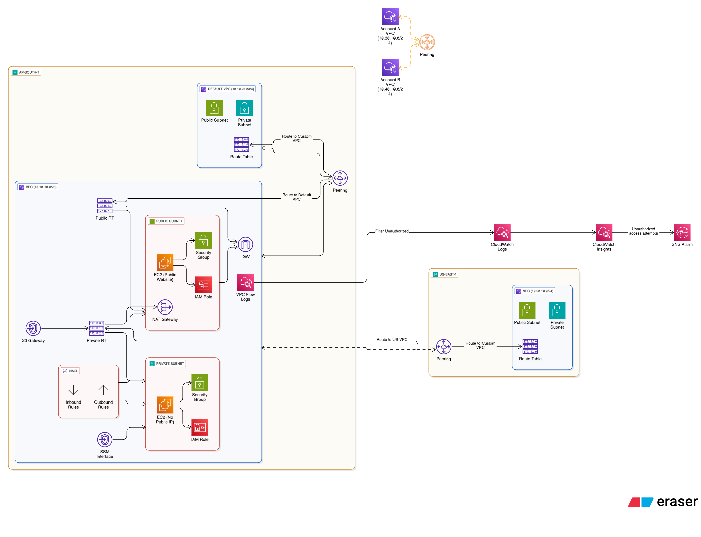

# AWS VPC Networking – Real-World Scenarios 

This project covers practical VPC networking scenarios designed to match real production use cases.  
Each scenario includes explanations, and step-by-step implementation.

---

## Scenario 1: CIDR Planning  
VPC CIDR: 10.10.10.0/26  
Subnetting logic explained.

---

## Scenario 2: VPC + Public & Private Subnets  
• VPC creation  
• Public subnet  
• Private subnet  
• Route tables  

---

## Scenario 3: Host a Public Website  
• IGW attached  
• Public route table  
• EC2 reachable from internet  

---

## Scenario 4: NAT Gateway for Private Subnet  
• No public IP  
• Private instances → internet via NAT  
• Use cases in real companies  

---

## Scenario 5: NACL vs Security Group  
**Use Case:**  
Public instance allows RDP only from private subnet, not internet.

Key points:  
• NACL higher priority  
• NACL is stateless  
• Block inbound + allow outbound  

---

## Scenario 6: Same-Region VPC Peering  
• No transitive routing  
• CIDRs cannot overlap  
• Update route tables on both sides  

---

## Scenario 7: Cross-Region Peering  
ap-south-1 ↔ us-east-1  
Private communication without IGW/NAT/VPN.

---

## Scenario 8: Inter-Account VPC Peering  
• Account A ↔ Account B  
• Peering permissions  
• Route table update  

---

## Scenario 9: VPC Endpoints  
• S3 Gateway Endpoint  
• DynamoDB Gateway  
• Interface endpoints for private AWS API access  

---

## Scenario 10: VPC Flow Logs  
• Capture traffic  
• Troubleshooting denied packets  
• CloudWatch Logs + Insights  

---

## Scenario 11: Alerts for Unauthorized Access  
• CloudWatch metric filter  
• CloudWatch Alarm  
• SNS notification  

---
